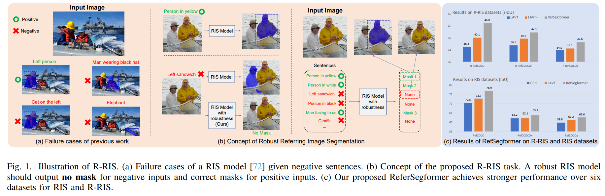
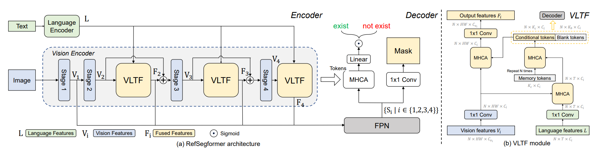
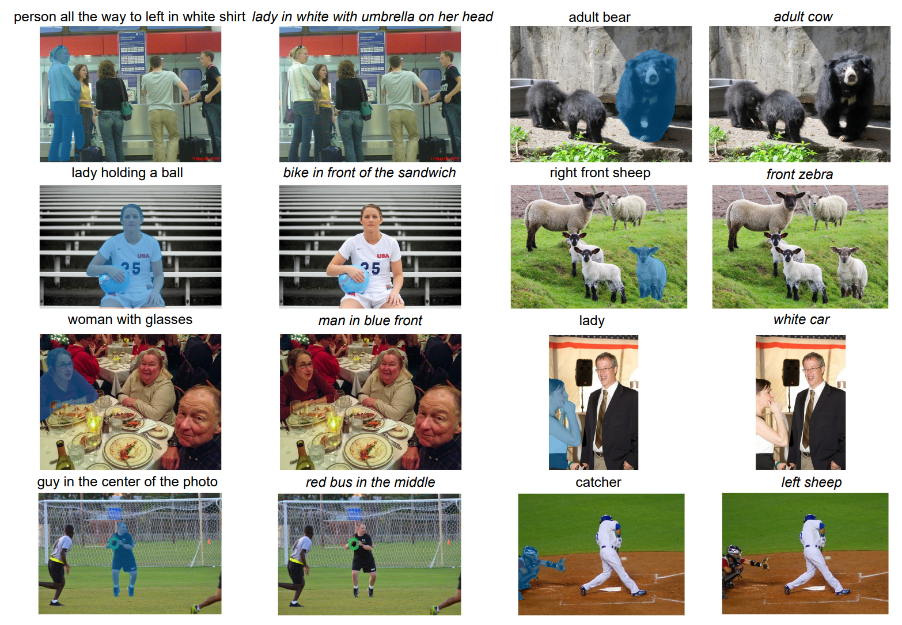

<br />
<p align="center">
  <h1 align="center">Towards Robust Referring Image Segmentation</h1>
  <p align="center">
    <br />
    <a href="pass"><strong>Jianzong Wu</strong></a>
    ·
    <a href="https://lxtgh.github.io/"><strong>Xiangtai Li</strong></a>
    ·
    <a href="https://xialipku.github.io/"><strong>Xia Li</strong></a>
    ·
    <a href="https://henghuiding.github.io/"><strong>Henghui Ding</strong></a>
    ·
    <a href="https://scholar.google.com.hk/citations?user=T4gqdPkAAAAJ&hl=zh-CN"><strong>Yunhai Tong</strong></a>
    ·
    <a href="https://www.bing.com/search?q=Dacheng+Tao&form=ANNTH1&refig=cd2b7dfcc451414f809a2fe7ad8b3fbb&pc=EDGEDSE"><strong>Dacheng Tao</strong></a>
  </p>

  <p align="center">
    <a href='https://arxiv.org/abs/2209.09554'>
      
    </a>
    <a href='https://github.com/jianzongwu/robust-ref-seg'>
      
    </a>
  </p>
<br />

<div  align="center">    
 
</div>

**Our work is the first to explore robustness in referring image segmentation, including task definition, benchmark, and baseline models.**

# ⭐ Abstract

Referring Image Segmentation (RIS) is a fundamental vision-language task that outputs object masks based on text descriptions. Many works have achieved considerable progress for RIS, including different fusion method designs. In this work, we explore an essential question, “What if the text description is wrong or misleading?” For example, the described objects are not in the image. We term such a sentence as a negative sentence. However, existing solutions for RIS cannot handle such a setting. To this end, we propose a new formulation of RIS, named Robust Referring Image Segmentation (R-RIS). It considers the negative sentence inputs besides the regular positive text inputs. To facilitate this new task, we create three R-RIS datasets by augmenting existing RIS datasets with negative sentences and propose new metrics to evaluate both types of inputs in a unified manner. Furthermore, we propose a new transformer based model, called RefSegformer, with a token-based vision and language fusion module. Our design can be easily extended to our R-RIS setting by adding extra blank tokens. Our proposed RefSegformer achieves state-of-the-art results on both RIS and R-RIS datasets, establishing a solid baseline for both settings.

# 📢 Updates

- [2022.9.17] The robust referring image segmentation datasets [R-RefCOCO](https://drive.google.com/file/d/19qGViJigR5AXhkZlNmu89jI4cvAJ7pnP/view?usp=sharing), [R-RefCOCO+](https://drive.google.com/file/d/19qGViJigR5AXhkZlNmu89jI4cvAJ7pnP/view?usp=sharing), and [R-RefCOCOg](https://drive.google.com/file/d/19qGViJigR5AXhkZlNmu89jI4cvAJ7pnP/view?usp=sharing) are released!

# 🏆 Contributions

- **Robust Referring Image Segmentation Task.** We present the Robust Referring Image Segmentation (R-RIS) task, the first robust-based RIS, which extends the RIS task to account for the possibility of incorrect referring expressions.

- **R-RefCOCO Series Dataset.** We construct three benchmarks for the R-RIS task and propose new metrics to evaluate R-RIS models. We also benchmark several baseline methods for R-RIS.

- **Strong R-RIS Model.** We develop RefSegformer, a Transformer-based model incorporating VLTF modules specially designed for the R-RIS task. RefSegformer achieves state-of-the-art performance on six datasets from both RIS and R-RIS tasks, demonstrating its effectiveness and robustness

# ⚡ RefSegformer

<div  align="center">    
 
</div>

The components of RefSegformer are cohesively designed to handle both RIS and R-RIS tasks, allowing for robust interaction between vision and language information.

# 👁️ Visualization

An visualization of RefSegformer. Sentences in *italic* describe non-existent objects.

<div  align="center">    
 
</div>


# 📜 Citation
If you find our work useful in your research, please consider citing: 
```
@article{wu2022towards,
  title={Towards robust referring image segmentation},
  author={Wu, Jianzong and Li, Xiangtai and Li, Xia and Ding, Henghui and Tong, Yunhai and Tao, Dacheng},
  journal={arXiv preprint arXiv:2209.09554},
  year={2022}
}
```

# 🙏 Acknowledgement

Thanks to the excellent works and repos: [MAttNet](https://github.com/lichengunc/MAttNet), [EFN](https://github.com/fengguang94/CEFNet), [LAVT](https://github.com/yz93/LAVT-RIS) and [LAVT-pytorch](https://github.com/lifeGWT/LAVT-pytorch).